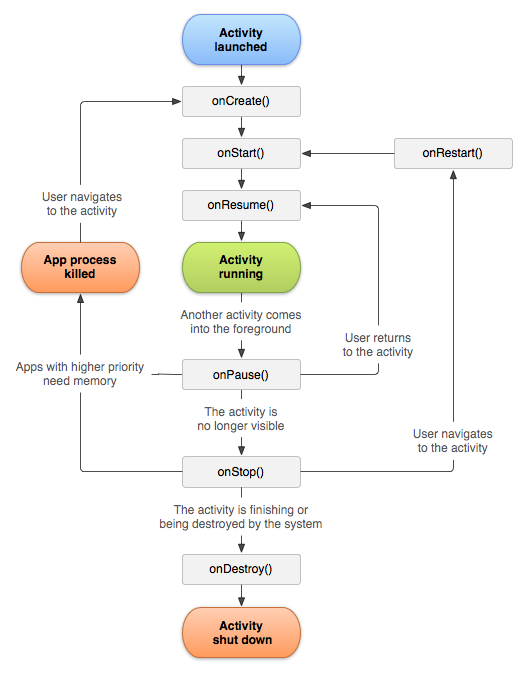

#  Fragments

## Resources
* [Fragments](https://developer.android.com/guide/components/fragments.html)
* [Android Version History](https://en.wikipedia.org/wiki/Android_version_history)
* [Handling Lifecycles](https://developer.android.com/topic/libraries/architecture/lifecycle.html)

## Learning Objectives
* Students will be able to create fragments that react properly to the
  Fragment Lifecycle
* Students will be able to build apps with fragments where a portion of the
  app displays a fragment with a detail view of an item in a list.

## Lecture Outline
* Recall when tablets started becoming a thing
* Android added Fragments with Honeycomb Android 3.0 APIv11
* Fragments were added to support UIs for devices with larger screens: tablets
* Fragments allow us to write apps that behave as if two activities were
  running side by side
* Imagine splitting a table screen in half
  * One half can show a list of items like an email inbox
  * The second half can show the details for one email
  * Users can click on an email in the list on the left and then view the
    details of that list on the right
  * Small-screen mobile phones didn't have much need for fragments and the
    ability to display UIs like this because there screens were just too
    small
  * As tablet became more popular it was essential to give developers a way to
    present users with rich UIs like this

### Activity Lifecycle vs Fragment Lifecycle
Activities and Fragments have different lifecycles. Activities can be
interrupted by users rotating their screen, by pressing the home button,
by switching to another application, by pressing the lock button, and more.

Fragments can be interrupted in different ways, like a user selecting a
different email in a left-hand pane triggering an action to swap one fragment
out for another.

#### Activity Lifecycle Diagram

#### Fragment Lifecycle Diagram

### Demo
Create an activity that has a list view and a detail view in a fragment. Swap
the fragments when the user selects another item from the listview.
